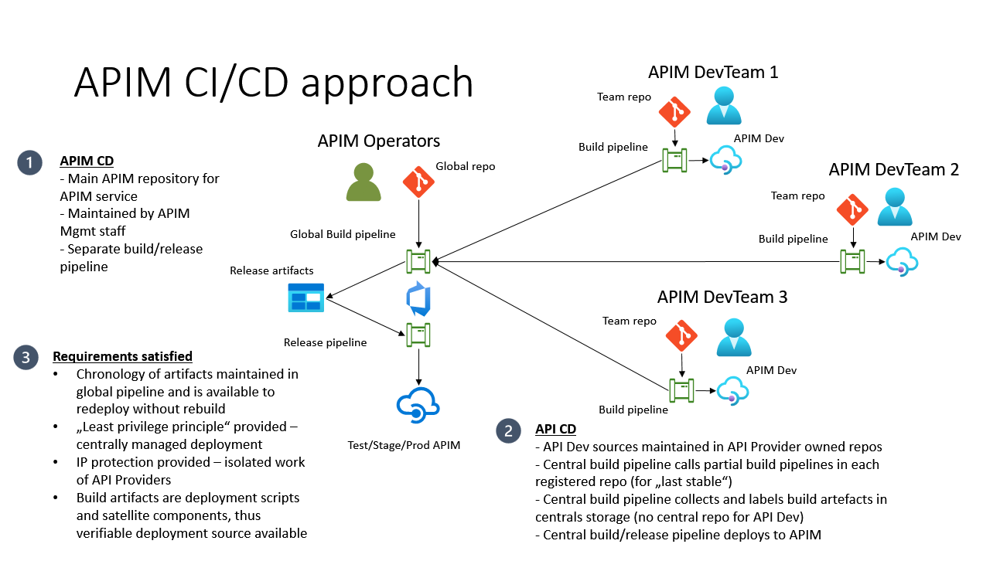
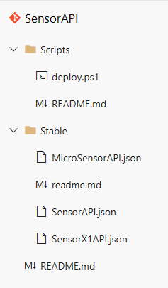

# apimcicd
Azure APIM: API CI/CD approach

# Intention: description, requirements, restrictions

- Azure API Management as the API gateway in a Cloud Solution.
- Multiple backend services expose API endpoints for publishing by Azure APIM instance.
- Multiple independend dev teams design, develope and prepare the API definitions for deployment on the APIM instances [prod, test,...].
- The teams develop with unsynchronized development and deployment cycles.
- The teams must be protected against possible collisions in API definitions and configurations.
- The teams must be isolated to keep the IP protection.
- Only APIM operating staff is eligible to deploy the APIs to the non-dev APIM instances ("least privileges principle").
- Rollback to any previous API configuration must be available at any timepoint in the lifecycle of the APIM without any need to contact any API development team for previous versions of their APIs.
- The complete source of the APIM must be available to APIM operating staff at any timepoint in the lifecycle.
- The CI/CD processes must be automated.

# Design

Following approach design is implemented to satisfy requirements:

The development and deployment processes are implemented with Azure DevOps and look like following:

## API development

- Each API Dev team works in an isolated Azure DevOps project.
- Such a project contains at least one repository to maintain API definitions, deployment scripts and satellite assets.

- Optionally, each API Dev team may use an own APIM developmentg instance for development, test and stabilizing purposes.
- Each API Dev project contains at least one build pipeline, which collects, validates and publishes to pipeline artifactory the deployment components (API definitions, deployment scripts and satellite assets).
- Each build pipeline should publish only stable artifacts (which do not break deployment, do not collide with other possible APIs on th same instance, doi not violate compliance rules, do not break or degrade the overall functionality of the APIM instance - repsonsibility of the API Dev team by the validation routines in the build pipeline).
- The build pipelines runs are unsynchronized between different API Dev teams.
  
## API deployment

- There's a central Azure DevOps projects assigned to the APIM operating staff, who only eligible to change configuration of the prod or test APIM instances.
- This project contains at least one repository to maintain APIM templates, parameters, deployment scripts and satellite assets to deploy the APIM instance (without APIs and products).

- This repository must maintain deployment scripts for APIs (but not the API definitions etc. themselves).
- There's a collector pipeline, which downloads the last stable API artifacts from each API development project, collects them in separate subfolders, performs validation and publishes to pipeline artifactory.
- There's at least one release pipeline, which donwloads the collected API definitions and deploys them to the target APIM instance (prod, test, ...).
